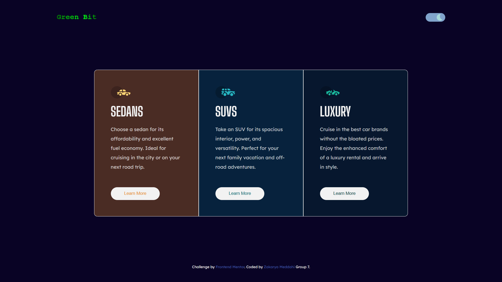

# Frontend Mentor - 3-column preview card component solution

This is a solution to the [3-column preview card component challenge on Frontend Mentor](https://www.frontendmentor.io/challenges/3column-preview-card-component-pH92eAR2-).

### Light Theme

### Dark Theme

<!-- ### Links

- Solution URL: [Add solution URL here](https://your-solution-url.com)
- Live Site URL: [Add live site URL here](https://your-live-site-url.com) -->

### Built with

- Semantic HTML5 markup
- CSS custom properties
- Flexbox
- Mobile-first workflow

## Author

- Website - [Zakarya Meddahi](https://www.your-site.com)
- Frontend Mentor - [@ZakaryaMeddahi](https://www.frontendmentor.io/profile/ZakaryaMeddahi)
- LinkedIn - [Zakarya Meddahi](https://www.linkedin.com/in/zakarya-meddahi-472bb3241/)